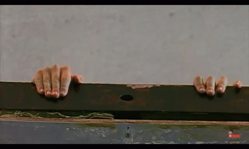

# 🧠 Brain

*aka Notes with Atom*

> Healthy reaction, constructive reaction, can start from a wrong idea clearly defined, whereas mere muddle effects nothing whatever
>—Ezra Pound



No peeking!

I use this setup for thinking with Atom.

## Setup

I use `asdf` for managing node versions.  I run this repo on `v6.3.1`.

Assuming you have that setup and `brew` installed.

```bash
npm install
brew install atom
apm install browser-plus@0.0.98 busy-signal@2.0.1 clipboard-plus@0.5.1 \
  date@2.6.0 file-icons@2.1.39 git-plus@8.7.1 hey-pane@1.2.0 \
  highlight-colors@0.9.0 highlight-line@0.12.0 highlight-selected@0.17.0 \
  intentions@1.1.5 link-helper@0.2.0 linkist@1.3.1 lint-scroll-marker@0.3.0 \
  linter@2.3.1 linter-markdown@5.2.11 linter-ui-default@1.8.1 \
  markdown-fold@0.3.0 markdown-image-assistant@0.2.2 \
  markdown-preview-enhanced@0.17.7 markdown-toc@0.4.2 prettier-atom@0.58.2 \
  scroll-marker@0.3.2 tree-view-git-status@1.5.2 wordcount@3.1.0
```

## Usage  
Atom
`alt`-`cmd`-`t`: open terminal  
`cmd`-`p`: project file search
`cmd`-`P`: command palette (use to add date)
`cmd`-`,`:  settings

`ctrl`-`shift`-`m`: markdown preview
`cmd`-`k`: panes
`cmd`-`K`: pane toggle
`ctrl`-`(`: git pane
`cmd`-`k`,`cmd`-`b`: toggle tree

`ctrl`-`l`: create ^tag^
`ctrl`-`alt`-`l`: jump to next ^tag^
`ctrl`-`{`: fold all
`opt`-`cmd`-`]`: unfold this
`opt`-`cmd`-`}`: unfold all


Drop photos in and they will go to the assets folder.
